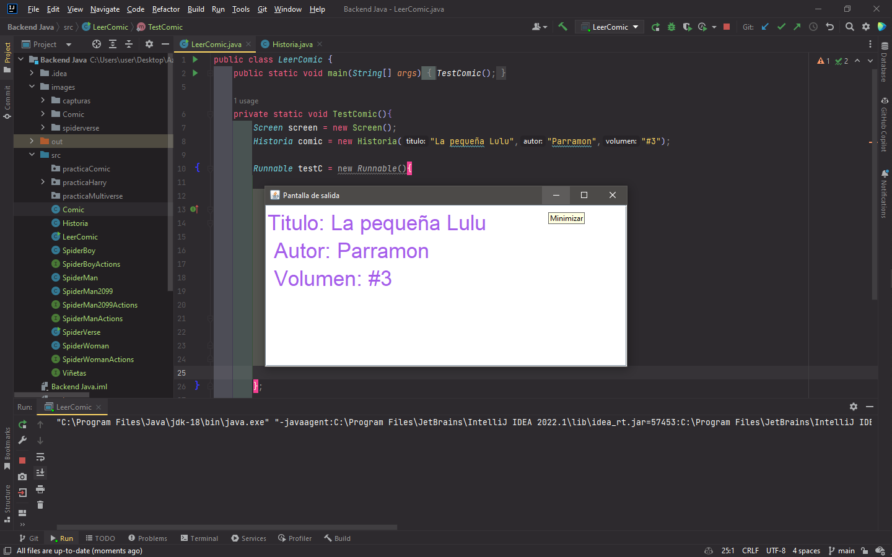
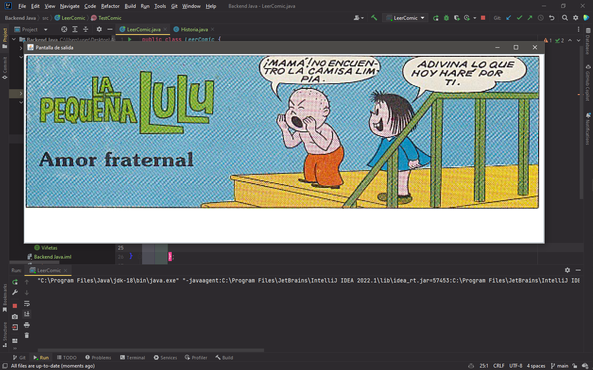
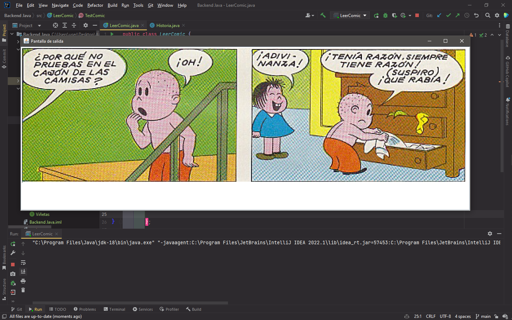
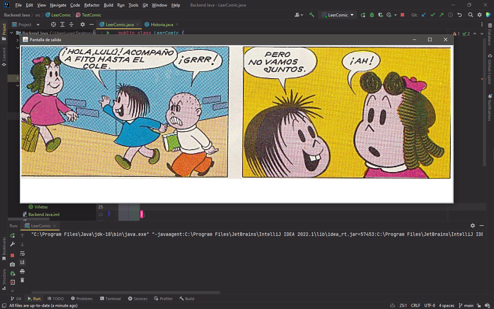
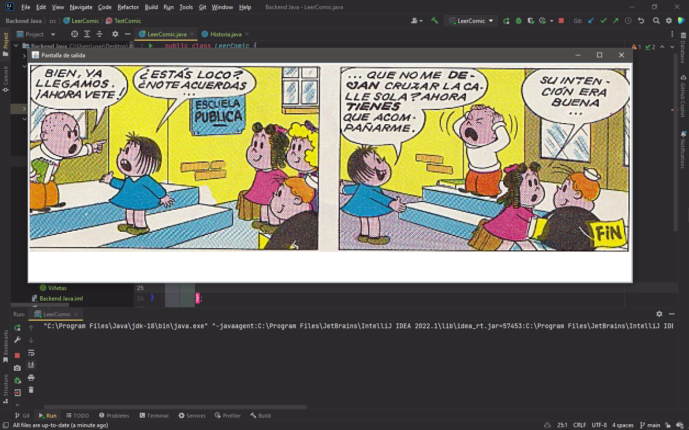
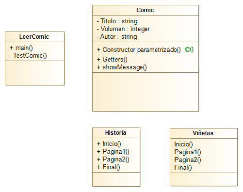

# Capturas del funcionamiento

Las siguientes imagenes son sobre el funcionamiento del programa
practicaComic el cual conciste en poder leer un comic mostrando 
las viñetas dentro de una interfaz sencilla. 

Esta interfaz esta realizada con el uso del Framework imonsh, el cual tiene
una lincencia limitada para uso local y no para su distribución.

# Diagrama de Clases

A continuación tenemos el diagrama de clases donde se muestra
la estructura completa para poder implementar el programa en el
lenguaje deseeado.

