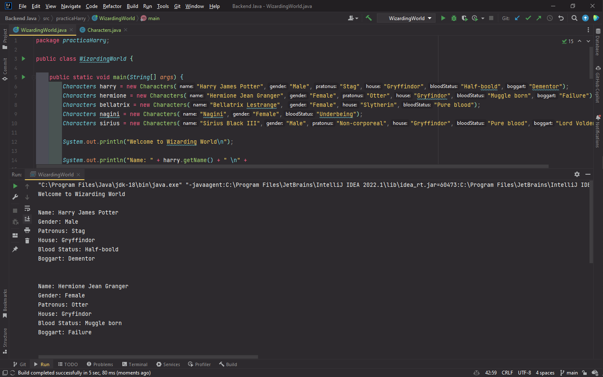
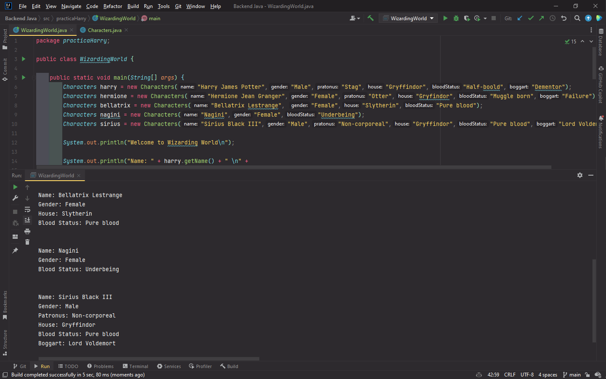

# Capturas del funcionamiento

Las siguientes imagenes son sobre el funcionamiento del programa
practicaHarry, el cual nos muestra en su ejecución la información de
5 personajes del Mundo Magico de Harrypoter.

# Diagrama de Clases

A continuación tenemos el diagrama de clases donde se muestra
la estructura completa para poder implementar el programa en el
lenguaje deseeado.

