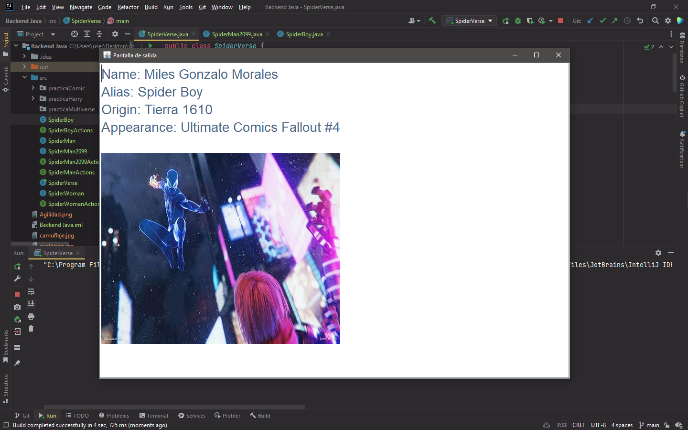
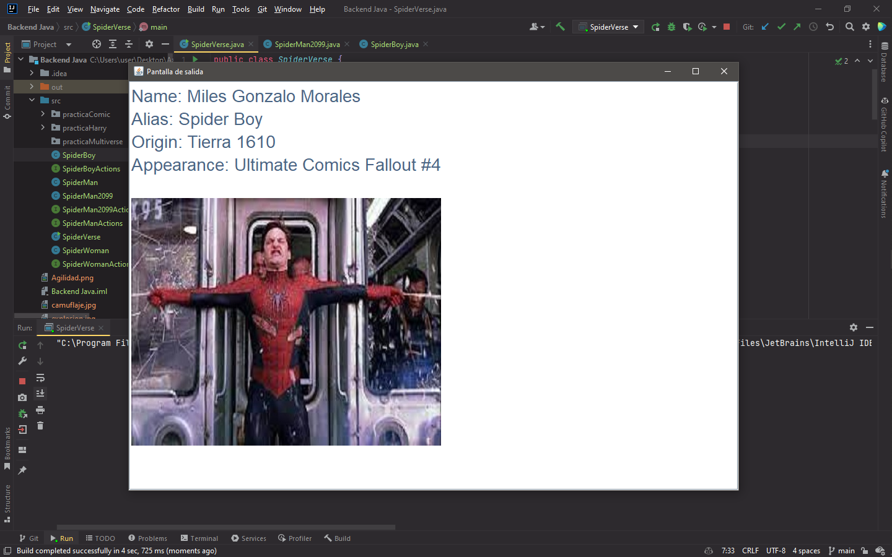
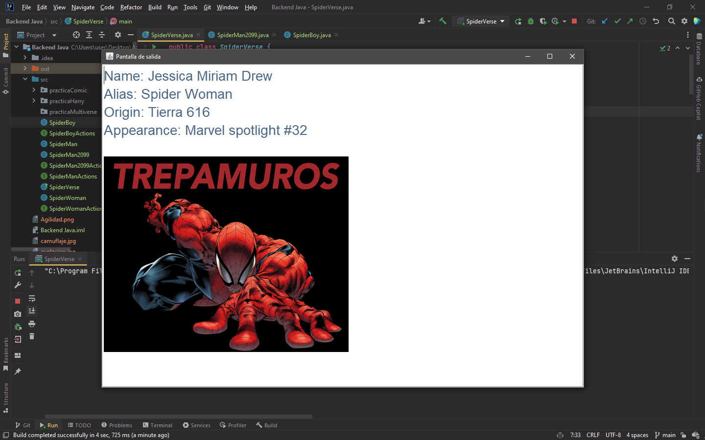
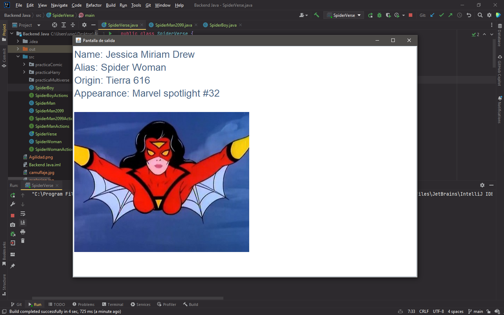
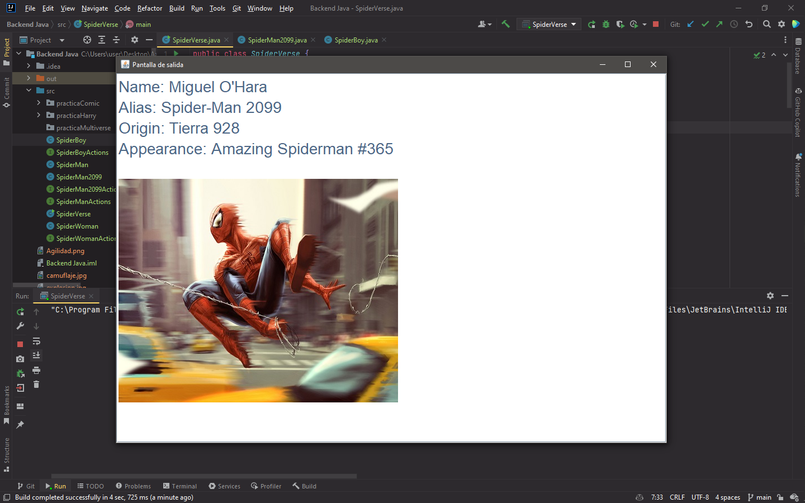
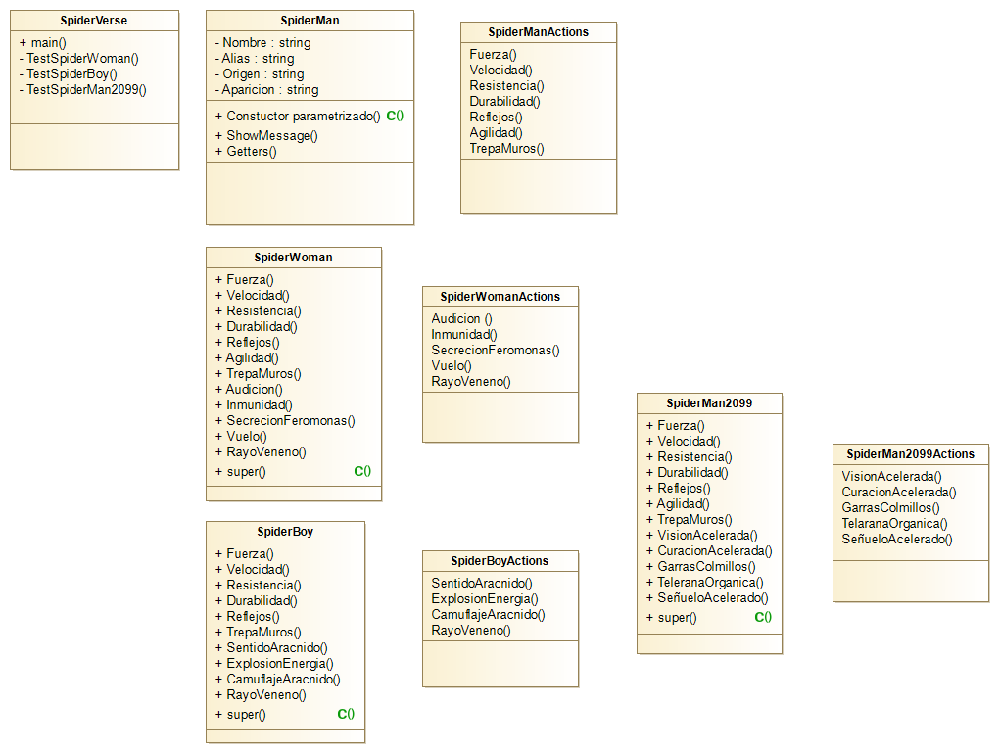

# Capturas del funcionamiento

Las siguientes imagenes son sobre el funcionamiento del programa
practicaMultiverse, se sabe que Spiderman tiene un multiverso muy extenso
por lo que conocer sobre los diferentes universos y sus Spiderman puede
ser muy complicado. Por eso mediante una interfaz sencilla, se muestra la
información general de cierto Spiderman y un set de movimientos
para tener más información al respecto del personaje.

Esta interfaz está realizada con el uso del Framework imonsh, el cual tiene
una licencia limitada para uso local y no para su distribución.

### Spider Boy

### Spider Woman

### Spider Man 2099

# Diagrama de Clases

A continuación tenemos el diagrama de clases donde se muestra
la estructura completa para poder implementar el programa en el
lenguaje deseeado.

